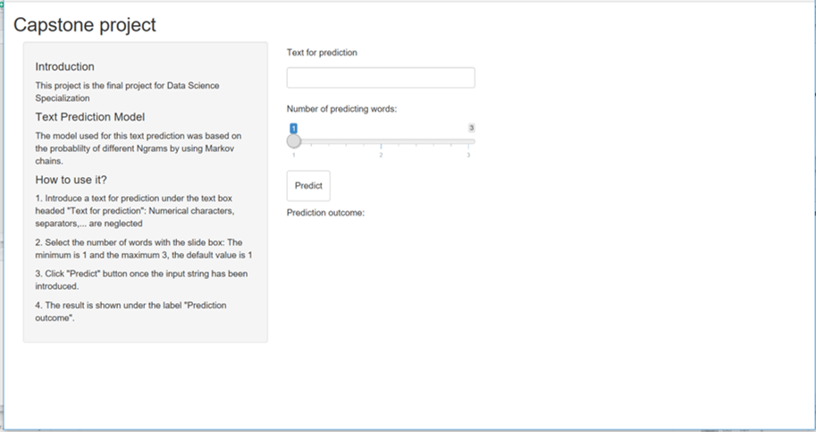
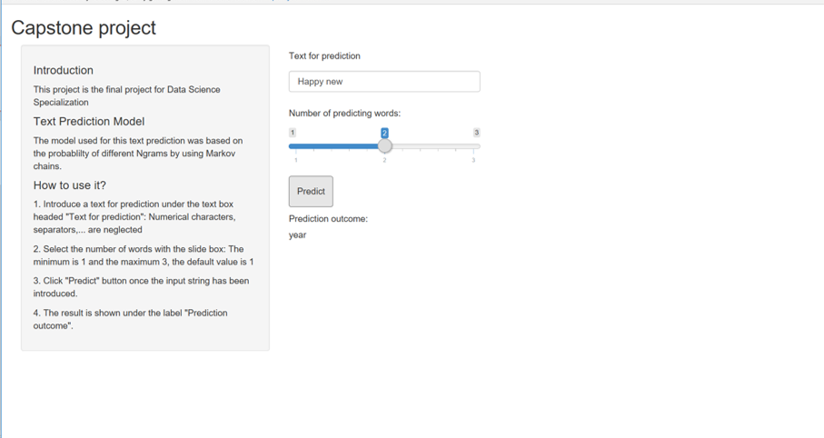

Capstone project: Data science certification, John Hopkins University, Offered by coursera
========================================================
author: Sergio Ortiz
date: 03/26/2017
autosize: true

Introduction
========================================================

The application tries to predict the next word by introducing some key words: 

How it works?
========================================================

- 1. Introduce a text for prediction under the text box headed "Text for prediction": Numerical characters, separators,... are neglected
- 2. Select the number of words with the slide box: The minimum is 1 and the maximum 3, the default value is 1"),
- 3. Click "Predict" button once the input string has been introduced.
- 4. The result is shown under the label "Prediction outcome"

Result
========================================================

If the light version of the database finds a match a text will be shown under prediction outcome, otherwise "na" will be shown 

Future work
========================================================

The prediction model is very light, a lot of errors and unmatches are possible:

1. Increase Corpus size and/or type.
2. Increase machine resources for creating more powerful database

For more information, please go to: 
